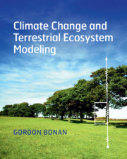

# bonanmodeling

Matlab and Python code for the textbook [*Climate Change and Terrestrial Ecosystem Modeling*](http://www.cgd.ucar.edu/staff/bonan/ecomod/index.html), or CCaTEM, by [Dr. Gordon Bonan](http://www.cgd.ucar.edu/staff/bonan/) of the US National Center for Atmospheric Research.

  

Each directory is named for a supplemental program described in the book. The directory `sp_xx_yy` contains code for supplemental program `yy` in Chapter `xx`. The directory `sp_02_01`, for example, is the code for supplemental program 2.1 (Chapter 2, program 1). Each directory has a main program and may have additional files called by that program. For example, `sp_02_01.m` is the Matlab program for supplemental program 2.1 (there are no additional files). In Matlab, type `sp_02_01` to run the program. Or, from the command line, run `matlab -nosplash -nodesktop -r "sp_02_01"`. For Python, simply run `python sp_02_01.py` from the command line or open the file in Jupyter Lab. All directories are similarly structured, but may have additional files.

Translation of the original Matlab files into Python provided by [Dr. Adam Erickson](https://adamerickson.xyz) of Washington State University, performed with the latest [Anaconda distribution for Python](https://www.anaconda.com/distribution/).
